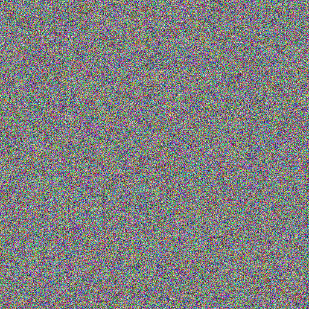

# Bitmap Plus Plus
Simple and Fast header only Bitmap (BMP) library

## Bitmap Type Supported
- 24 Bits Per Pixel (RGB)

## Examples
<strong>Random Pixel Colors</strong>
<br>
```cpp
#include "BitmapPlusPlus.hpp"
#include <random>
#include <iostream>

static bmp::Pixel random_color()
{
	static std::random_device seed{};
	static std::default_random_engine engine{seed()};
	std::uniform_int_distribution<std::int32_t> dist(0, 255);
	bmp::Pixel color{};
	color.r = dist(engine);
	color.g = dist(engine);
	color.b = dist(engine);
	return color;
}

int main(void)
{
	try
	{
		// Create a 512x512 bitmap
		bmp::Bitmap image(512, 512);

		// Assign a random color to each pixel in the image
		for (bmp::Pixel &pixel : image)
		{
			pixel = random_color();
		}

		// Save bitmap to new file image.bmp
		image.save("image.bmp");

		// And Voila!
		return EXIT_SUCCESS;
	}
	catch (const bmp::Exception &e)
	{
		std::cerr << "[BMP ERROR]: " << e.what() << std::endl;
		return EXIT_FAILURE;
	}
}
```


<br><br>

<strong>Mandelbrot Fractal Set</strong>
<br>
```cpp
#include "BitmapPlusPlus.hpp"
#include "ColorMaps.inl"
#include <iostream>

int main(void)
{
    try
    {
        bmp::Bitmap image(600, 400);

        double cr, ci;
        double nextr, nexti;
        double prevr, previ;
        constexpr const std::uint16_t max_iterations = 3000;

        for (std::int32_t y = 0; y < image.height(); ++y)
        {
            for (std::int32_t x = 0; x < image.width(); ++x)
            {
                cr = 1.5 * (2.0 * x / image.width() - 1.0) - 0.5;
                ci = (2.0 * y / image.height() - 1.0);

                nextr = nexti = 0;
                prevr = previ = 0;

                for (std::uint16_t i = 0; i < max_iterations; ++i)
                {
                    prevr = nextr;
                    previ = nexti;

                    nextr = prevr * prevr - previ * previ + cr;
                    nexti = 2 * prevr * previ + ci;

                    if (((nextr * nextr) + (nexti * nexti)) > 4)
                    {
                        const double z = sqrt(nextr * nextr + nexti * nexti);

                        //https://en.wikipedia.org/wiki/Mandelbrot_set#Continuous_.28smooth.29_coloring
                        const std::uint32_t index = static_cast<std::uint32_t>(1000.0 * log2(1.75 + i - log2(log2(z))) / log2(max_iterations));

                        image.Set(x, y, jet_colormap[index]);

                        break;
                    }
                }
            }
        }

        image.save("mandelbrot.bmp");
    }
    catch (const bmp::Exception& e)
    {
        std::cerr << "[BMP ERROR]: " << e.what() << std::endl;
        return EXIT_FAILURE;
    }
    return EXIT_SUCCESS;
}
```


<br><br>

<strong>Julia Fractal Set</strong>
<br>

```cpp
#include "BitmapPlusPlus.hpp"
#include "ColorMaps.inl"
#include <iostream>

int main(void)
{
    try
    {
        bmp::Bitmap image(600, 400);

        constexpr const std::uint16_t max_iterations = 300;

        constexpr const double cr = -0.70000;
        constexpr const double ci = 0.27015;

        double prevr, previ;

        for (std::int32_t y = 0; y < image.height(); ++y)
        {
            for (std::int32_t x = 0; x < image.width(); ++x)
            {
                double nextr = 1.5 * (2.0 * x / image.width() - 1.0);
                double nexti = (2.0 * y / image.height() - 1.0);

                for (std::uint16_t i = 0; i < max_iterations; ++i)
                {
                    prevr = nextr;
                    previ = nexti;

                    nextr = prevr * prevr - previ * previ + cr;
                    nexti = 2 * prevr * previ + ci;

                    if (((nextr * nextr) + (nexti * nexti)) > 4)
                    {
                        const bmp::Pixel color = hsv_colormap[static_cast<std::size_t>((1000.0 * i) / max_iterations)];
                        image.set(x, y, color);
                        break;
                    }
                }
            }
        }

        image.save("julia.bmp");
    }
    catch (const bmp::Exception& e)
    {
        std::cerr << "[BMP ERROR]: " << e.what() << std::endl;
        return EXIT_FAILURE;
    }
    return EXIT_SUCCESS;
}
```


<br><br>

<strong>Modify The Penguin</strong>
<br>

```cpp
#include "BitmapPlusPlus.hpp"
#include <iostream>

int main(void)
{
	try
	{
		bmp::Bitmap image("penguin.bmp");
		// Modify loaded image (makes half of the image black)
		for (std::int32_t y = 0; y < image.height(); ++y)
		{
			for (std::int32_t x = 0; x < image.width() / 2; ++x)
			{
				image.set(x, y, bmp::Black);
			}
		}
		// Save bitmap to file
		image.save("modified-penguin.bmp");
	}
	catch (const bmp::Exception& e)
	{
		std::cerr << "[BMP ERROR]: " << e.what() << std::endl;
		return EXIT_FAILURE;
	}
	return EXIT_SUCCESS;
}
```


<br><br>

<strong>Modify The Penguin</strong>
<br>

```cpp
#include <iostream>
#include "BitmapPlusPlus.hpp"

int main()
{
    try
    {
        // 8x8 chess board
        bmp::Bitmap image(640, 640);
        const std::size_t board_dims = 8;
        const std::size_t rect_w = image.width() / board_dims;
        const std::size_t rect_h = image.height() / board_dims;

        // Iterate over rects
        bool is_white = true;
        for (std::size_t x = 0; x < image.width(); x += rect_w)
        {
            for (std::size_t y = 0; y < image.height(); y += rect_h)
            {
                bmp::Pixel color = is_white ? bmp::White : bmp::Black;
                // Fill rect
                for (size_t dx = x; dx < x + rect_w; dx++)
                {
                    for (size_t dy = y; dy < y + rect_h; dy++)
                    {
                        image.set(dx, dy, color);
                    }
                }
                is_white = !is_white;
            }
            is_white = !is_white;
        }

        // Save bitmap to file
        image.save("chess_board.bmp");

        return EXIT_SUCCESS;
    }
    catch (const bmp::Exception &e)
    {
        std::cerr << "[BMP ERROR]: " << e.what() << '\n';
        return EXIT_FAILURE;
    }
}
```


## Features and bugs
If you face any problems feel free to open an issue at the [issue tracker][tracker]. If you feel the library is missing a feature, please raise a ticket on Github. Pull request are also welcome.

[tracker]: https://github.com/baderouaich/BitmapPlusPlus/issues


